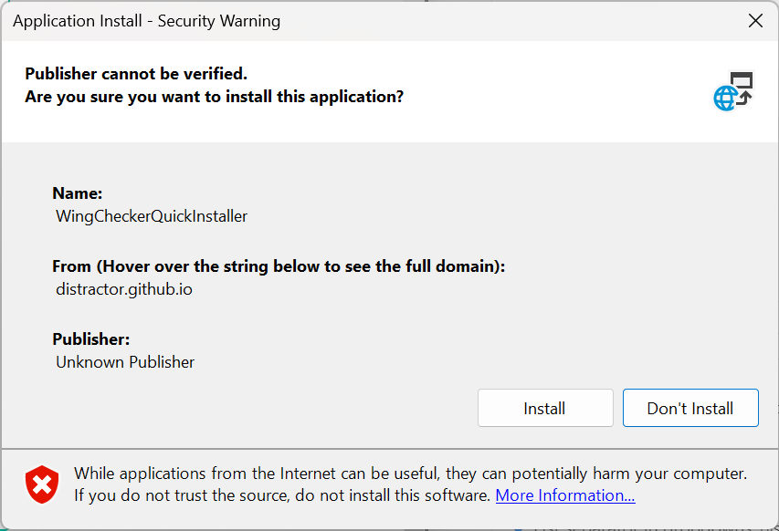

# Installation

Requirements:

- Windows operating system
- Installed Microsoft Office Excel
- Internet connection

!!! warning 
    Since this is not a native Windows application, you QuickInstaller will install a digital certificate **before** installing the Add-in.

## Install

To install the WingChecker VSTO Excel Add-in follow these steps:

1. **Download the Quick Installer:** You can download the Quick Installer file from [**here**](../files/QuickInstaller/setup.exe){:download="setup.exe"}.
2. **Run the installer:** Double-click on the downloaded installer to start.
3. **Follow the Installation Prompts:** Accept any warnings or prompts from your operating system and wait for the installation to complete.
    
    ??? tip "Common Installation Prompts"

        Since this is not a native Windows application, your operating system might warn you before installation.
        { width=70%}

        If that happens, click on **More info** and select **Run anyway**.
        { width=70%}

        Before installing the WingChecker Add-in, a security warning can appear. This is a general warning Windows issues when automatically running installers from the internet. Click **Install** to continue.
        { width=70%}

        Installation prompt will pop up. Select **Install** and wait untill the installation process is completed.
        { width=70%}

!!! note
    The WingChecker Add-in is delievered together with a digital code certificate. The quick installer will thus 
    
    1. Download and install the digital code certificate and
    2. Download and install the WingChecker Add-in.

        
### Verify installation

To verify installation:

1. **Launch a New Excel Instance:** Open a new Excel workbook.

If the installation was successful, the WingChecker Add-in will be visible in the **Add-ins** tab of the Excel ribbon.

{ width=70%}

## Updating

Excel checks for an update every time you launch a new instance. If a new version of **WingChecker** is available, it will automatically install it.

## Uninstallation

To uninstall the WingChecker VSTO Excel Add-in, follow these steps:

1. **Access the Control Panel:** Open the Control Panel on your Windows system.
2. **Locate Add/Remove Programs:** Find and click on the "Add or Remove Programs" option.
3. **Uninstall WingChecker:** Locate "WingChecker" in the list of installed programs and click the "Uninstall" button.

!!! info
    If you encounter any issues during the installation or uninstallation process, please refer to our troubleshooting guide or contact our [support team](../support/support.md).
