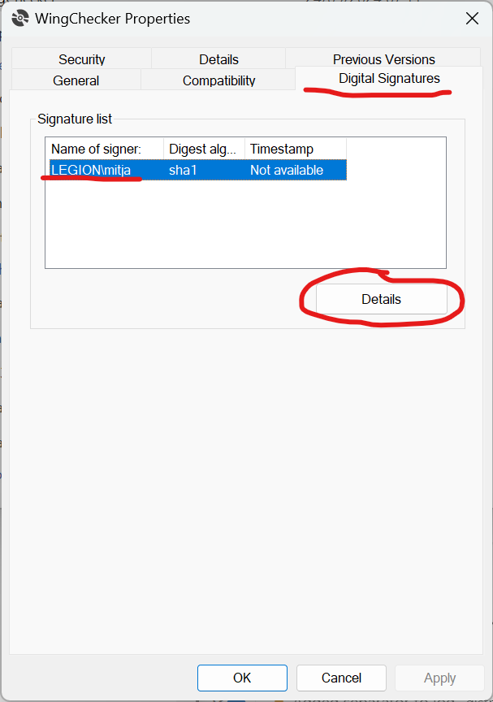
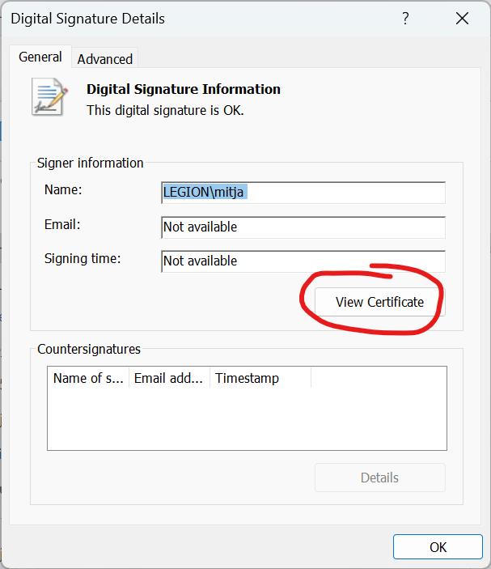
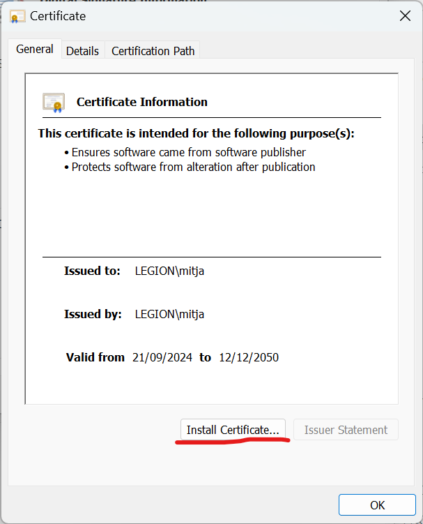
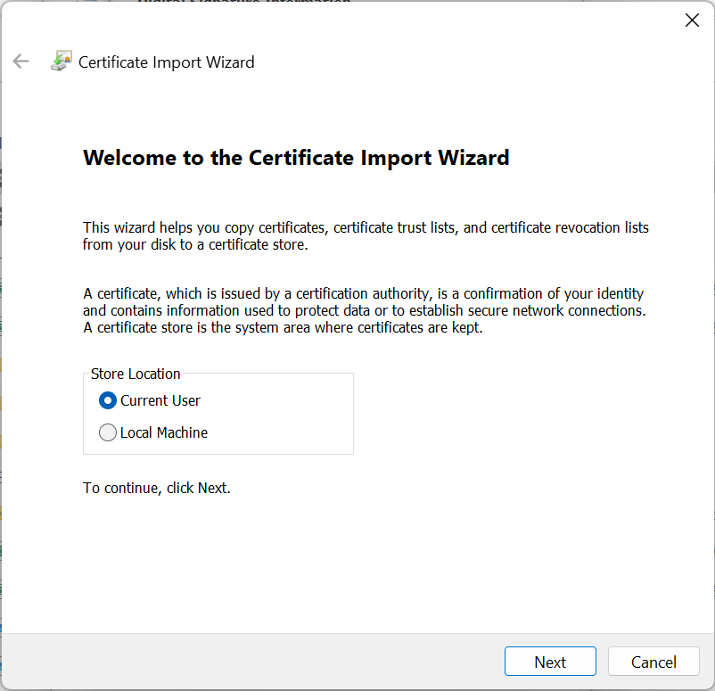
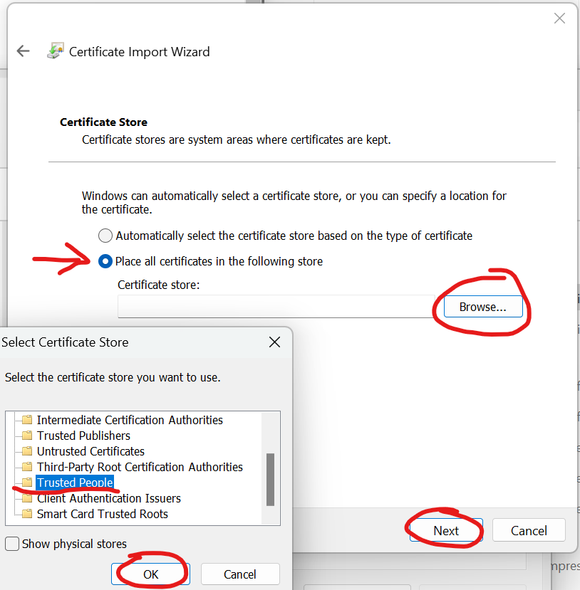
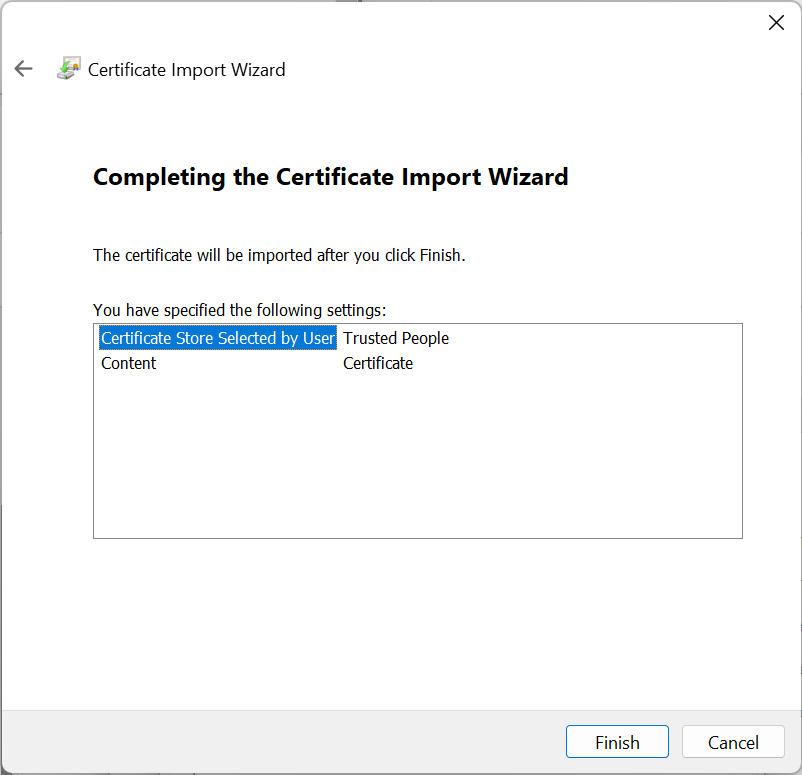

# Installation

Requirements:

- Windows operating system
- Installed Microsoft Office Excel
- Internet connection

!!! warning 
    Since this is not a native Windows application, a digital code certificate must be installed **before** installing the Add-in. For clarity, see installation guide for

    - [**Quick Install**](#__tabbed_1_1) or 
    - [**Manual Installation**](#__tabbed_1_2).

## Install

!!! quote "Installation guide"

    === "Quick Install"
        An installation script was prepared as part of the development process. You can download the installation script [**here**](../files/WingCheckerSetup.bat){:download="WingCheckerSetup.bat"} or click on the button below

        [Download Installation Script](../files/WingCheckerSetup.bat){:download="WingCheckerSetup.bat" .md-button .md-button--primary }

        Once downloaded, right-click on the file and select **Run as Administrator**. This will:

        - Download and install the digital code certififcate and
        - Download and install the WingChecker AddIn.

        ??? tip "Common Installation Prompts"

            Since this is not a native Windows application, your operating system might warn you before running the installation script.
            { width=70%}

            If that happens, click on **More info** and select **Run anyway**.
            { width=70%}

            Installation prompt will pop up. Select **Install** and wait untill the installation process is completed.
            { width=70%}

    === "Manual Installation"

        To manually install the WingChecker VSTO Excel Add-in follow these steps:

        1. **Download the Installer:** You can download the installer file from [**here**](../files/WingChecker/setup.exe){:download="WingChecker.exe"}.

            [Download installer](../files/WingChecker/setup.exe){:download="WingChecker.exe" .md-button .md-button--primary }

        **Install the Digital Code Certificate**

        1. Right-click on the downloaded *WingChecker.exe* and select **Properties**. 
        2. In the top menu, select **Digital Signatures**. 
        3. From the Signature list, select the digital signature named `LEGION\mitja` and click on **Details**.

            { width=50%}

        4. A new window opens. Click on **View Certififcate**.

            { width=50%}

        5. In a new window select **Install Certificate**.

            { width=50%}

        6. Certificate installation wizzard opens. Select **Current User** and click **Next**.

            { width=50%}

        7. **Warning!** This step is very important for successful installation. 
            
            Select **Place all certififcates in the following store**, then click **Browse** and look for **Trusted People**. Select **OK** and click **Next**.

            { width=50%}

        8. Select **Finish** and wait for success message.

            { width=50%}

        9. Close all windows oppened in the proccess.

        **Install AddIn**

        1. **Run the installer:** Double-click on the downloaded installer to start.
        2. **Follow the Installation Prompts:** Accept any warnings or prompts from your operating system and wait for the installation to complete.
            
            ??? tip "Common Installation Prompts"

                Since this is not a native Windows application, your operating system might warn you before installation.
                { width=70%}

                If that happens, click on **More info** and select **Run anyway**.
                { width=70%}

                Installation prompt will pop up. Select **Install** and wait untill the installation process is completed.
                { width=70%}

        
### Verify installation

To verify installation:

1. **Launch a New Excel Instance:** Open a new Excel workbook.

If the installation was successful, the WingChecker Add-in will be visible in the **Add-ins** tab of the Excel ribbon.

{ width=70%}

## Update

Excel checks for an update every time you launch a new instance. If a new version of **WingChecker** is available, it will automatically install it.

## Uninstall

To uninstall the WingChecker VSTO Excel Add-in, follow these steps:

1. **Access the Control Panel:** Open the Control Panel on your Windows system.
2. **Locate Add or Remove Programs:** Find and click on the "Add or Remove Programs" option.
3. **Uninstall WingChecker:** Locate "WingChecker" in the list of installed programs and click the "Uninstall" button.
4. **Delete the Digital Code Certififcate (Optional):**
    1. Initialize a new instance of Command Prompt.
    2. Copy paste the following line to your Command Prompt.
        ```bat
        Certutil -store TrustedPeople
        ```
    3. In the output, which should look something similar to this
        ```bat hl_lines="4 5"
        C:\Users\mitja>Certutil -store TrustedPeople
        TrustedPeople "Trusted People"
        ================ Certificate 0 ================
        Serial Number: fde7036eca21f0a44c22e67119e3fc58
        Issuer: CN=LEGION\mitja
        NotBefore: 21/09/2024 08:52
        NotAfter: 12/12/2050 00:00
        Subject: CN=LEGION\mitja
        Signature matches Public Key
        Root Certificate: Subject matches Issuer
        Cert Hash(sha1): 47d27c80b9642882318f41fca5a8fda2c24675ac
        No key provider information
        Provider = Microsoft Strong Cryptographic Provider
        Simple container name: PvkTmp:4ad6844b-2e1e-4ecb-9b04-b42e81d7ded2
        Unique container name: ca46e0b8fd93edc96f075e19a2a1c9f9_68a74995-8b4e-4347-8ef8-7339d1e1b982
        ERROR: missing key association property: CERT_KEY_IDENTIFIER_PROP_ID
        Signature test passed
        CertUtil: -store command completed successfully.
        ```
        find certififcate with `Issuer: LEGION\mitja` and copy the `Serial Number` from the line above.
    4. Replace the `certID` with the serial number and execute the following line in your command prompt.
        ```bat
        Certutil -delStore TrustedPeople certID
        ```
!!! info
    If you encounter any issues during the installation or uninstallation process, please refer to our [support team](../support/support.md).
