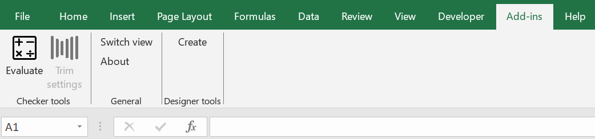

# Installation

Requirements:

- Windows operating system
- Installed Microsoft Office Excel
- Internet connection

!!! warning 
    Since this is not a native Windows application, you have to install a digital certificate **before** you install the Add-in. Follow [certificate installation](#installing-digital-certificate) instructions below.

## Install

To install the WingChecker VSTO Excel Add-in follow these steps:

1. **Download the digital certificate:** The certificate is delivered together with the WingChecker package. You can download the `WingChecker.cer` file from [**here**](../files/QuickInstaller/setup.exe){:download="setup.exe"}.

### Verify installation

To verify installation:

1. **Launch a New Excel Instance:** Open a new Excel workbook.

If the installation was successful, the WingChecker Add-in will be visible in the **Add-ins** tab of the Excel ribbon.

{ width=70%}

## Updating

Excel checks for an update every time you launch a new instance. If a new version of **WingChecker** is available, it will automatically install it.

## Uninstallation

To uninstall the WingChecker VSTO Excel Add-in, follow these steps:

1. **Access the Control Panel:** Open the Control Panel on your Windows system.
2. **Locate Add/Remove Programs:** Find and click on the "Add or Remove Programs" option.
3. **Uninstall WingChecker:** Locate "WingChecker" in the list of installed programs and click the "Uninstall" button.

!!! info
    If you encounter any issues during the installation or uninstallation process, please refer to our troubleshooting guide or contact our [support team](../support/support.md).
