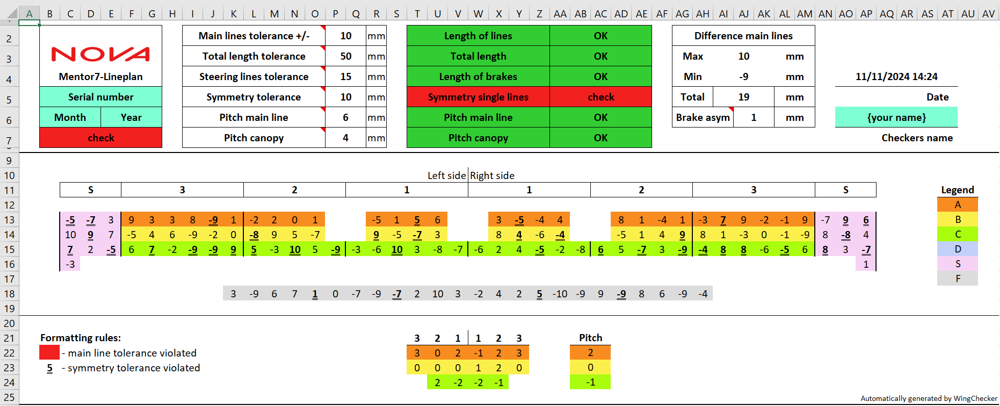
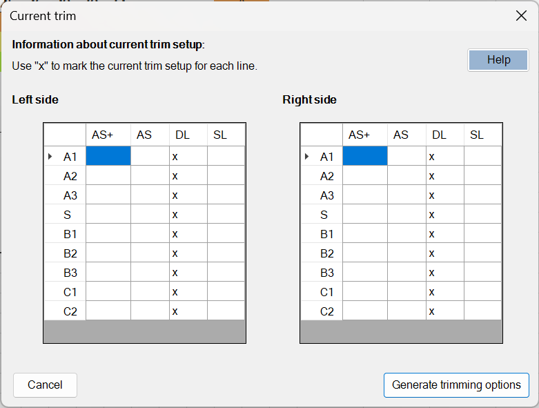
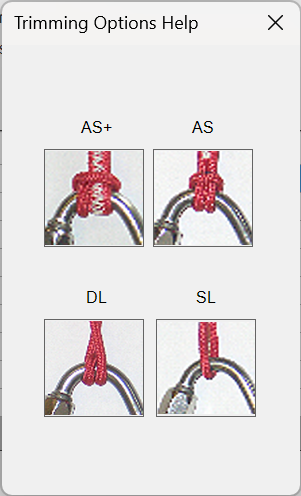
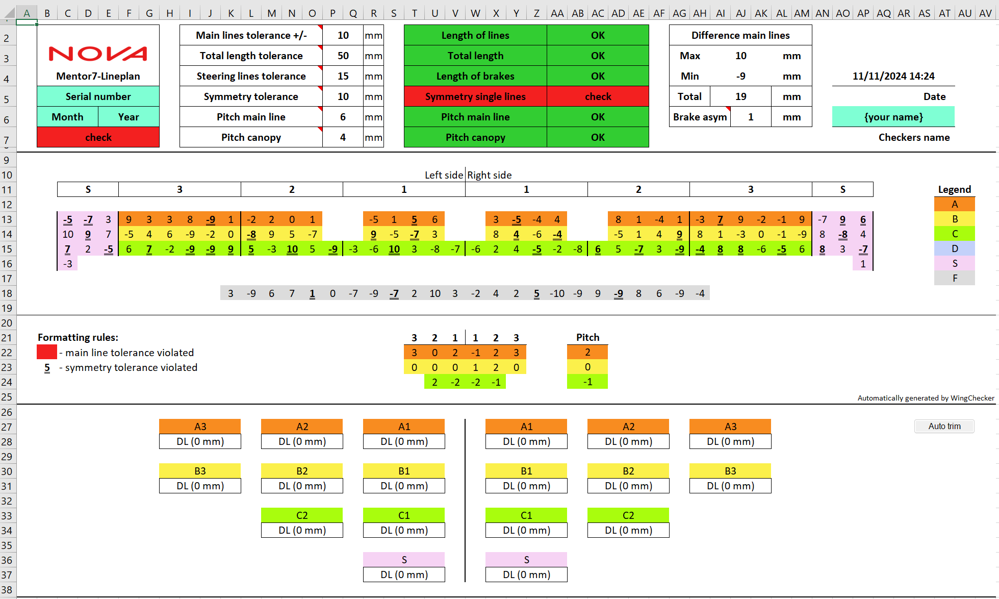
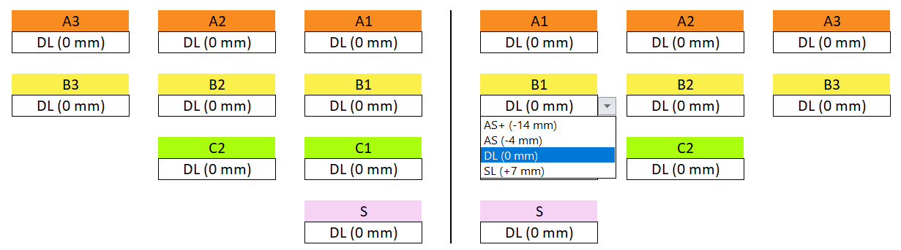

# Manual for Checkers

This guide outlines the tools and functionalities available to checkers using **WingChecker**. It also provides instructions for basic usage.

## Available Checking Tools

WingChecker offers several tools designed to assist in the evaluation process. All tools are accessible via the **ribbon** in Excel.

### Switch View

The **Switch View** button allows you to zoom in or out while conducting measurements. This function is limited to the *Measuring* sheet and helps improve visibility during the checking process.

### About

Clicking the **About** button provides information regarding the WingChecker Add-in, including details about the development team, version number, and other relevant technical information.

## Evaluation Process

This section guides you through the process of evaluating a wing using WingChecker.

### Measuring and Evaluating the Wing

Once you have input all the measured line lengths in the *Measuring* sheet, click the **Evaluation** button on the ribbon to begin the evaluation process.

!!! warning "Missing line lengths"
    WingChecker will verify that all lines have been measured. If any measurements are missing, a warning will be displayed, and the evaluation will not proceed until the data is complete.

### The *Evaluation* Sheet

Upon successful evaluation, the *Evaluation* sheet will display the results. It should resemble the following example:  
{ width=100% }

#### Formatting Rules

To enhance clarity, WingChecker employs conditional formatting within the *Evaluation* sheet:

- **CYAN**: Indicates where user input is required. These cells are editable.
- **RED**: Signals that a tolerance limit has been exceeded.
- **GREEN**: Indicates that the line is within the allowed tolerance.
- **Line Level Colors**: Each line is color-coded according to its level. A legend explaining these levels is located on the far right of the sheet. Stabilo and brake lines are consistently marked with **S** and **F**, respectively.
- **Double Underlined Numbers**: These signify that the deviation between the same lines on opposite sides of the wing exceeds the permissible tolerance.

!!! note "Reminder"
    Ensure all cyan-colored cells are filled in correctly.

## Tolerances

The designers have provided some default values for the allowed tolerances. These can be changed, but only by an amount allowed and defined by the designers. If you change a specific tolerance too much, a warning is rasied and the value is returned to the default.

!!! note "Tolerance list"
    - **Main lines:** Maximum allowed deviation of main lines.
    - **Total length:** Maximum allowed average absolute deviation of all lines.
    - **Steering lines:** Maximum allowed deviation of brake lines.
    - **Symmetry:** Maximum allowed deviation from same line on the other side of the wing. Brakes excluded.
    - **Pitch main line:** Pitch main lines.
    - **Pitch canopy:** Pitch canopy.

## Trimming Setup

To configure trimming, click the **Trim Settings** button on the ribbon.

### Generating Trimming Options

Clicking **Trim Settings** opens a form where you can select the initial trim setup (i.e., prior to the completed check) for each main line on both sides of the wing. 

Each row in the table corresponds to a main line, and each column represents an available trimming option.

{ width=60%}

!!! note "Trimming options"
    - **AS+:** cow hitch + single loop.
    - **AS:** cow hitch.
    - **DL (default for new wings):** double loop.
    - **SL:** single loop

    By pressing the **Help** button, you will also get the visuals.

    { width=20%}

!!! warning
    Each main line should have only one "x" in its corresponding row, indicating the selected trimming option. An example of valid input is shown in the form image above.

Once the form is completed, click **Generate Trimming Options** to apply the selected trim settings to the *Evaluation* sheet. The result should resemble the following example:  
{ width=100% }

### Using the Trimmers

To apply trimmers, select the desired trim option from the dropdown menu.  
{ width=70% }

After selection, WingChecker will automatically adjust all lines attached to the selected main line according to the chosen trim option.

## Re-Measuring

After the trim is set, click on the **Finish** button. This will re-direct you to the _Measuring_ sheet, because the lines whose trim was changed need to be re-measured.

Only lines whose trim was changed, will be shown.

!!! note
    If you want to show all lines, click on the **Switch View** button from the toolbar.

### Using the Auto-Trimmer

WingChecker comes with an automatic trimming strategy. By clicking on the **Auto trim** button in the sheet, WingChecker will suggest you a good trim.

!!! warning 
    The automatic suggestions are by no means optimal in terms of safety and performance. It is up to the checker to assure a safe and reasonable trim. 

## Finalization

Before closing the workbook, ensure the following:

1. (Optional) Print the evaluation report.
2. Save the workbook.