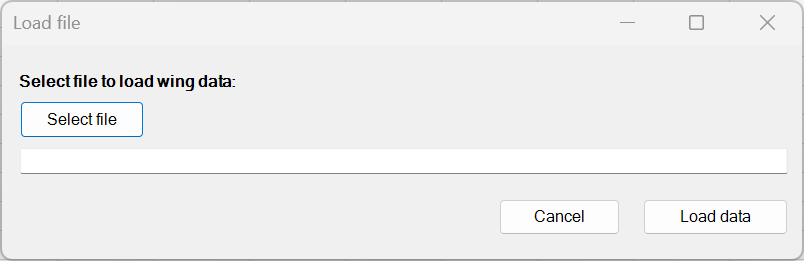
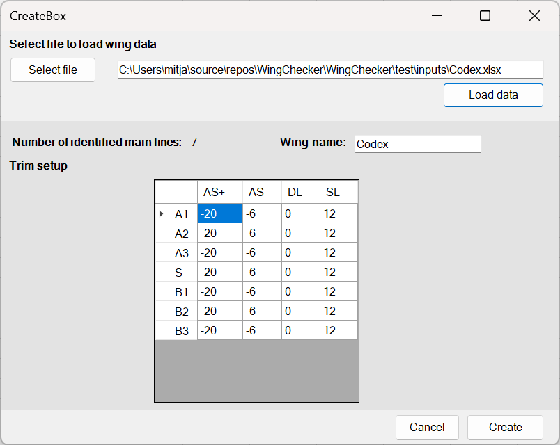
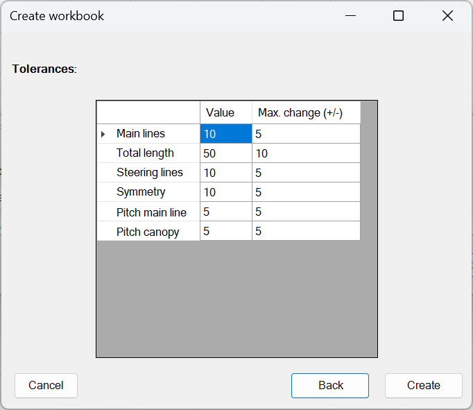

# Manual for Production

This guide explains how to create a check workbook using **WingChecker**. It is intended for **designers** who possess the necessary input files required to generate the workbook.

!!! tip
    If you are a checker, please refer to the [Checkers' Manual](manual.md) for relevant instructions.

## Preparing a New Check Workbook

To prepare a new check workbook:

1. **Launch Excel**: Open a new instance of Microsoft Excel.
2. **Locate the Add-ins Tab**: Navigate to the **Add-ins** section located on the ribbon.
3. **Create new Workbook**: Click the **Create Workbook** button (located on the far left). A new form will appear in the centre of your screen.  
   { width=70% }
4. **Select Input File**: Click **Select File**, then navigate to the Excel file generated by **WingDesigner** for the respective wing.
5. **Load Data**: Click **Load Data**. Once the data is successfully loaded, the second form will become available.  
   { width=70% }
6. **Optional Step**: Input the **Wing Name** or retain the default name provided.
7. **Configure Trim Setup**: 
    The table displayed defines the adjustments to line lengths for different trimming options. Rows correspond to main lines, while columns represent various trimming options.

    !!! warning
        Checkers are not able to modify this data.

    !!! note "Available trimming options"
        - **AS+:** Cow hitch with a single loop
        - **AS:** Cow hitch only
        - **DL:** Double loop (this is the default for new wings) 
        - **SL:** Single loop

8. **Tolerances:** Click **Next** to show the tolerance table.
    { width=70% }

    The table displayed defines the allowed tolerances (first column) and maximum allowed tolerance change by the checker.

    !!! note "Tolerance list"
        - **Main lines:** Maximum allowed deviation of main lines.
        - **Total length:** Maximum allowed average absolute deviation of all lines.
        - **Steering lines:** Maximum allowed deviation of brake lines.
        - **Symmetry:** Maximum allowed deviation from same line on the other side of the wing. Brakes excluded.
        - **Pitch main line:** Pitch main lines.
        - **Pitch canopy:** Pitch canopy.

9. **Finalize the Workbook**: Once all necessary configurations are made, click the **Create** button to generate the check workbook.

## Evaluation Process

For information regarding the evaluation process, please refer to the [Checkers' Manual](manual.md).