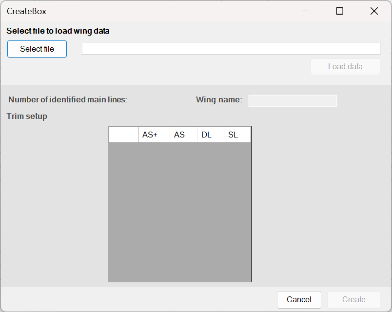

# Manual for production

This manual covers the creation of a check workbook using WingChecker. 

This manual is only relevant for the designers, as they are also the only ones with the input that is required to generate a check workbook.

!!! note
    If you are a checker, then you are likely interested in [Manual for checkers](manual.md).

## How to prepare a new check workbook

To prepare a new check workbook:

1. Open a new instance of Excel.
2. Navigate to **Add-ins** in the ribbon.
3. Click on the very left **Create workbook** button. A new form opens. 
    { width=400}
4. Click on **Select file** button and navigate to the Excel file that is ouput from **WingDesigner** for a particular wing.
5. Click the **Load data** button. If loading was successful, this will unlock the second part of the form and fill it with some default data.  
    { width=400}
6. **Optional:** Set value for **Wing name** or leave the defult.
7. Trim setup:
    
    !!! danger
        Checkers are not able to modify this data.
    
    Each entry in the table defines the amount of line length change. Per row all main lines are listed. Per column, all available trimming options are listed.

    !!! note inline "Trimming options"
        - **AS+:** cow hitch + single loop.
        - **AS:** cow hitch.
        - **DL (default for new wings):** double loop.
        - **SL:** single loop

8. Click **Create** button.

## Evaluation

For manual on evaluation, please proceed to the [Manual for checkers](manual.md).