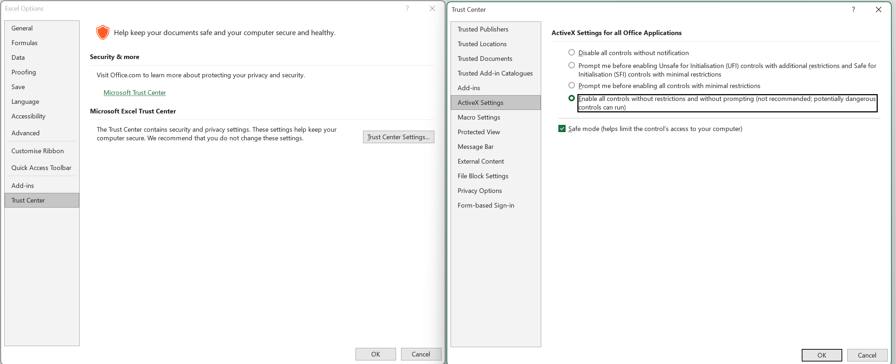

## Clicking on *Generate trimming options freezes*

It is very likely that you have to enable the _ActiveX_ support in your Excel.

To do that, go to *Excel* -> *Options*. There, select *Trust Center* and pick *ActiveX Settings*. From the list, try different levels of restrictions. 

!!! note
    It should work if you choose *Prompt me before enabling all controls with minimal restrictions.*. If that's not the case, just choose *Enable all controls without restrictions...*.

{ width=100% }

## Buttons are unresponsive

Very likely [Clicking on *Generate trimming options freezes*](#clicking-on-generate-trimming-options-freezes) solves this issue as well.